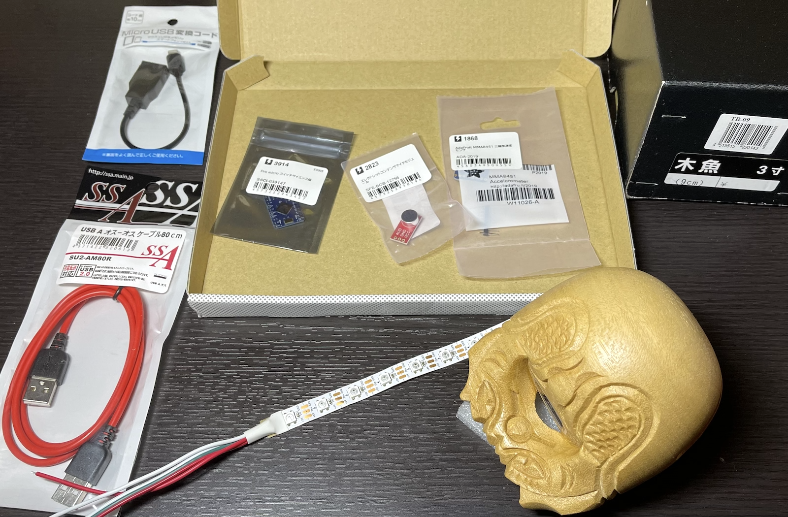
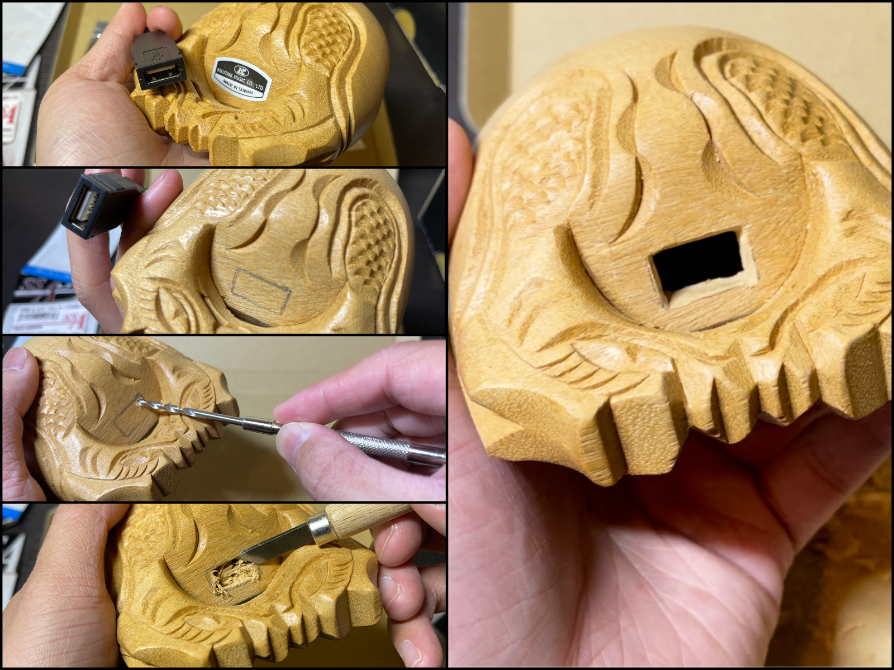

# mokugyOS

The operating system for USB connectable Mokugyo device.

日本語による解説記事は以下リンクより。（READMEの全てをカバーしています）  
[【USB木魚】叩くと光りながら般若心経が入力できるUSB接続型木魚を作ってみた【作り方解説 & ソースコード公開】 \- xor](https://xor.hateblo.jp/entry/20210529/1622257200)

## Hardware creation

### 1. Requirements

- Mokugyo  
  Recommendation: [Amazon\.co\.jp： キクタニ 木魚 3寸 9cm TB\-9: 楽器](https://www.amazon.co.jp/gp/product/B0013PR1WQ/)
- USB Standard-A(male) to Standard-A(male) cable
- USB Standard-A(female) to Micro-B(male) short cable
- Mallet (optional)
- Small Zabuton (Japanese cushion, optional)
- Microcontroller: [Pro Micro \- 5V/16MHz \- DEV\-12640 \- SparkFun Electronics](https://www.sparkfun.com/products/12640)
  - But you can choice any other ATmega32u4 based boards as main board, like [Arduino Micro](https://store.arduino.cc/usa/arduino-micro), [Arduino Leonardo](https://store.arduino.cc/usa/leonardo).
  - This README explains in case using Pro Micro.
- Accelerometer: [Adafruit Triple\-Axis Accelerometer \- ±2/4/8g @ 14\-bit \- MMA8451 : ID 2019 : $7\.95 : Adafruit Industries, Unique & fun DIY electronics and kits](https://www.adafruit.com/product/2019)
- Full-colored WS2812B compatible LED chip (5 pieces): [Adafruit NeoPixel Digital RGB LED Strip \- Black 60 LED \[BLACK\] : ID 1461 : $99\.80 : Adafruit Industries, Unique & fun DIY electronics and kits](https://www.adafruit.com/product/1461?length=1)
  - No need to buy Adafruit's LED because a bit expensive. Recommend NeoPixel compatible LED, like [フルカラーシリアルLEDモジュール \- SWITCH\-SCIENCE](https://www.switch-science.com/catalog/1398/), [NeoPixelフルカラーLEDテープ・5V版各種 – Shigezone Online](https://www.shigezone.com/?product=neopixel_ledtape5v), etc.
  - Only 5 pieces needed.
  - LED strip type is BEST, will helps making it simply.
- Microphone ~~(optional)~~: [SparkFun Electret Microphone Breakout \- BOB\-12758 \- SparkFun Electronics](https://www.sparkfun.com/products/12758)
  - Required from v0.2.

### 2. Drill a USB hole on Mokugyo

Make a square hole by drill and cutter.

Put large side of USB Standard-A(female) to Micro-B(male) short cable to this hole.

### 3. Connect sensors and LEDs to microcontroller

Pins assign:

| Sensor's Pin | Pro Micro's Pin |
|:--|:--|
| MMA8451 VIN | VCC |
| MMA8451 GND | GND |
| MMA8451 SDA | 2 |
| MMA8451 SCL | 3 |
| LED strip +5V | VCC |
| LED strip GND | GND |
| LED strip Din | 10 |
| Microphone VCC | VCC |
| Microphone GND | GND |
| Microphone AUD | A0 |

Note: Current version of mokugyOS does not support microphone listening yet so implementing it is optional. 

Do soldering to connect sensors to Pro Micro.

As for NeoPixel LED strip, cut 5 pixels and be careful about signal polarity at soldering (check Din pin's arrow sign direction on the strip).

### 4. Put sensors&controller unit into Mokugyo

1. Stick LED strip on inner side of Mokugyo using double sided tape.
2. Connect USB-MicroB connector to controller.
3. Push sensors&controller into Mokugyo.

Look the 3-axis sign on MMA8451 and pay attension at placing this sensor.  
`Z-axis`: be parallel with hit direction by mallet. Z+ direction is vertically above.  
`Y-axis`: Y+ direction is facing Mokugyo mouth (groove) from central.

## Software Installation

### 1. Install Arduino IDE on your PC if not yet

[Software \| Arduino](https://www.arduino.cc/en/software)

### 2. Install board support library for Pro Micro

Following instructions below:  
[sparkfun/Arduino\_Boards: Board definitions for SparkFun\-manufactured AVR, ARM, and ESP\-based Arduino boards\.](https://github.com/sparkfun/Arduino_Boards)

After board installation, please set options like above on Arduino IDE.  
**DO SELECT "ATmega32U4 (5V, 16 MHz)"**, not other one "(3.3V, 8 MHz)".

### 3. Install dependencies

Additional arduino libraries are below.  
Show the repositories here but all of them can be installed by arduino IDE built-in library manager.

- FreeRTOS  
  [feilipu/Arduino\_FreeRTOS\_Library: A FreeRTOS Library for all Arduino AVR Devices \(Uno, Leonardo, Mega, etc\)](https://github.com/feilipu/Arduino_FreeRTOS_Library)
  - **Note: MUST BE USE VERSION OF 10.4.4-2 OR EARLIER!**
- ~~NeoPixelBus by Makuna~~ (mokugyOS v0.1 only)  
  ~~[Makuna/NeoPixelBus: An Arduino NeoPixel support library supporting a large variety of individually addressable LEDs\. Please refer to the Wiki for more details\. Please use the gitter channel to ask questions as the GitHub Issues feature is used for bug tracking\.](https://github.com/Makuna/NeoPixelBus)~~
- Adafruit NeoPixel Library (mokugyOS v0.2~)  
  [adafruit/Adafruit\_NeoPixel: Arduino library for controlling single\-wire LED pixels \(NeoPixel, WS2812, etc\.\)](https://github.com/adafruit/Adafruit_NeoPixel)
- MIDIUSB  
  [arduino\-libraries/MIDIUSB: A MIDI library over USB, based on PluggableUSB](https://github.com/arduino-libraries/MIDIUSB)
- Adafruit MMA8451 Library  
  [adafruit/Adafruit\_MMA8451\_Library: Arduino library for the MMA8451 Accelerometer sensors in the Adafruit shop](https://github.com/adafruit/Adafruit_MMA8451_Library)
  - No need install [Adafruit Unified Sensor Driver](https://github.com/adafruit/Adafruit_Sensor).

### 4. Writing sutra data into EEPROM

**[ukkz/SutraWriter: EEPROM writer for mokugyOS\.](https://github.com/ukkz/SutraWriter)**

1. Connect your Mokugyo to PC with USB cable.
2. Clone or ZIP download ukkz/SutraWriter repository.
3. Open `SutraWriter.ino` with Arduino IDE.
4. Open Serial Monitor window, and then click upload button to write sketch into Mokugyo.  
5. SutraWriter runs immediately. Check Serial Monitor to verify EEPROM data like below:
  

### 5. Upload mokugyOS

Clone or ZIP download this repository and upload to your Mokugyo.

#### Configuration

All configurable parameters are placed in `Config.h`.

## How to use

### Mode change

Stand up and tilt left or right to change running mode.  
Lay down to run the selected mode.  
Default mode is "Chanting Keyboard". 

| LED color | Mode |
|:--|:--|
| Blue | Chanting Keyboard |
| Yellow | Serial Commander |
| Red | MIDI Instrument |
| White | Generic Directional Pad |
| Orange | Generic Mouse |
| Mixed | Game Controller |

About this color variants: [Buddhist flag \- Wikipedia](https://en.wikipedia.org/wiki/Buddhist_flag)

### Chanting Keyboard Mode

Sends sutra phrase per beat as USB HID keyboard.

### Serial Commander Mode

Sends beating and 4-directional tilting command as USB Serial device.

### MIDI Instrument Mode

Sends Note-On and Note-Off messages as USB MIDI device.

### Generic Directional Pad Mode

Sends beating (Enter key click) and 4-directional tilting (Arrow keys click) as USB HID keyboard.

### Generic Mouse Mode

Sends beating (Mouse left click) and 4-directional tilting (Mouse cursor move) as USB HID mouse.

### Game Controller Mode

Sends beating (Mouse left click), X-directional tilting (Horizontal mouse cursor move) and Y-directional tilting (`W` key or `S` key click) as USB HID keyboard & mouse.

## LICENCE

This project is licensed under the MIT License - see the LICENSE.md file for details.